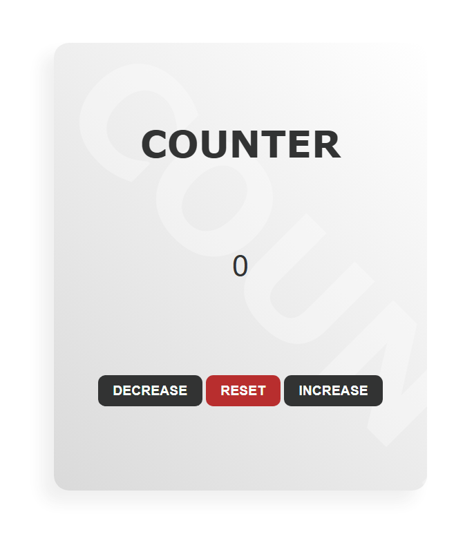

 

<!-- 🔰 BADGES -->

 

<!-- 🔰 PROJECT LOGO -->

 
 

<h1 align="center">🧮 Counter Website</h1>

A simple, interactive, and fully responsive  
**Counter Application** built using **HTML, CSS, and JavaScript**.

Designed to demonstrate JavaScript DOM manipulation through an intuitive interface that allows users to increase, decrease, and reset a numerical counter.

<a href="https://counter-website-tau.vercel.app/"><strong>➥ Live Demo</strong></a>

---

<!-- TABLE OF CONTENTS -->

  
📑 Table of Contents

  <ol>
    <li><a href="#about-the-project">About The Project</a></li>
    <li><a href="#features">Features</a></li>
    <li><a href="#built-with">Built With</a></li>
    <li><a href="#contact">Contact</a></li>
  </ol>

---

## 📖 About The Project

The **Counter Website** is a beginner-friendly JavaScript project that demonstrates how to manipulate the DOM through user interactions. It allows users to increment, decrement, and reset a numerical counter with a clean and responsive interface.

The project focuses on simplicity, usability, and real-time updates, making it an excellent example for understanding event handling, state changes, and dynamic content rendering using vanilla JavaScript.

This project showcases your ability to build **interactive web applications**, implement JavaScript functionality, and create responsive user interfaces with clean code and modern design principles.

Ideal for:

- JavaScript practice projects
- DOM manipulation exercises
- Beginner web development learning
- Interactive UI component demonstrations
- Front-end portfolio projects

---

## ✨ Features

- Fully responsive counter application
- Increase, decrease, and reset functionality
- Real-time counter updates
- Smooth button interactions
- Clean and minimal user interface
- Lightweight and beginner-friendly codebase
- Easy to customize and extend

---

## 🛠️ Built With

This project is built using:

- **HTML5**
- **CSS3**
- **JavaScript (Vanilla)**

---

## 📬 Contact

**Muhammad Salman Arshad**

- 💼 **LinkedIn:** https://www.linkedin.com/in/muhammad-salmanarshad/
- 🎨 **Figma:** https://www.figma.com/@codewithsalman
- 📧 **Email:** [msalmanwebdev@gmail.com](mailto:msalmanwebdev@gmail.com)

(<a href="#top">back to top</a>)

